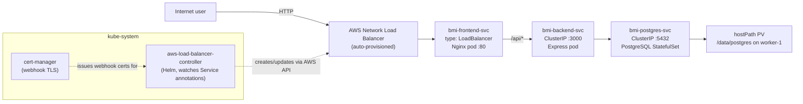
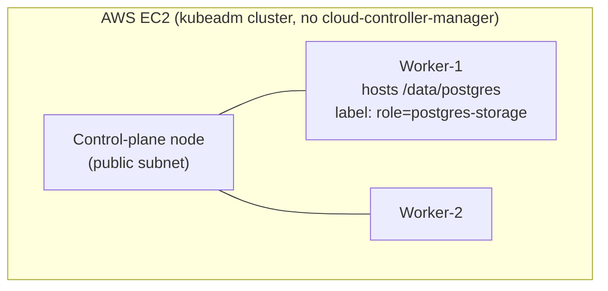

# BMI Health Tracker — AWS Load Balancer Controller Variant

Self-contained deployment guide for this folder only. Every command below is
runnable using just the contents of `k8s-LoadBalancer-annotations/` — no
other sibling `k8s-*` folder is required or referenced.

## 1. Overview

This folder deploys the **BMI Health Tracker**, a 3-tier web app, onto a
self-managed `kubeadm` Kubernetes cluster on AWS EC2, and exposes it to the
internet through a **real AWS Network Load Balancer (NLB) provisioned
automatically by the AWS Load Balancer Controller** — driven purely by
annotations on a Kubernetes `Service`, no manual AWS console clicking.

**Tech stack**

| Layer | Technology |
|---|---|
| Frontend | React 18 + Vite, served by Nginx (proxies `/api/*` to the backend) |
| Backend | Node.js 18 + Express, `pg` driver |
| Database | PostgreSQL (StatefulSet, hostPath-backed PersistentVolume) |
| Container registry | AWS ECR (`bmi-backend`, `bmi-frontend` repos) |
| Cluster | kubeadm (containerd runtime), 1 control-plane + 2 workers, self-managed on EC2 (no EKS) |
| Ingress/exposure | `Service type: LoadBalancer` + **AWS Load Balancer Controller** (Helm) + **cert-manager** (webhook TLS dependency) |
| Image pull auth | EC2 instance-profile role (`SSM`) via ECR credential provider / imagePullSecret |

**Architecture / traffic flow**





## 2. Focus of this folder

This variant's sole focus is: **3-tier app + Service `type: LoadBalancer`
fulfilled by the AWS Load Balancer Controller**, so that Kubernetes itself
(not a human) provisions and keeps in sync a real internet-facing AWS NLB —
including target registration/deregistration as pods/nodes change.

Out of scope here: Ingress path-based routing (see the ingress variant),
MetalLB (see the LoadBalancer/MetalLB variant), TLS termination/certificates
for the *app* itself (cert-manager here is only a controller-internal
dependency, not used for the app's HTTP endpoint), GitOps/ArgoCD.

## 3. What is the AWS Load Balancer Controller, and why here?

A `kubeadm` cluster on plain EC2 has **no cloud-controller-manager**, so
Kubernetes has no native way to satisfy `Service type: LoadBalancer` — it
would stay `Pending` forever. The **AWS Load Balancer Controller** is a
controller you install yourself (via Helm) that watches `Service`/`Ingress`
objects and calls the AWS API directly to create/update/delete a real
NLB/ALB and its target group, keyed off annotations like
`service.beta.kubernetes.io/aws-load-balancer-type`.

**Benefits**
- No manual AWS console/CLI step to create the load balancer or manage its
  target group — the controller registers/deregisters EC2 instances as
  targets automatically as nodes come and go.
- A single declarative Service manifest fully describes the desired AWS
  load balancer (scheme, subnets, health check).
- Closest to how a managed EKS cluster would behave, without EKS.

**Costs / trade-offs**
- Non-trivial one-time setup: IAM policy, subnet tagging, cert-manager,
  Helm chart, and (unique to self-managed kubeadm) manually patching
  `Node.spec.providerID` — none of this is needed on EKS, where it's built
  in.
- Extra moving parts running in the cluster (cert-manager + the controller
  pod) that must stay healthy for load-balancer reconciliation to keep
  working.
- `deploy.sh` in this folder **refuses to proceed** if the controller isn't
  already installed — it is a hard prerequisite, not optional.

Compared to the plain NodePort variant (simplest, but one raw port on every
node, no managed AWS resource) and the MetalLB variant (gives an
in-cluster EXTERNAL-IP but still needs a human to create the AWS NLB
pointing at it), this variant is the only one where Kubernetes manages the
real AWS load balancer end-to-end.

## 4. Implementation

### Prerequisites (apply to both A and B)

- A running kubeadm cluster (control-plane + ≥1 worker), e.g. provisioned by
  `provision-k8s-cluster.sh` from the `kubernetes-fundamentals` repo. That
  script writes `./k8s-cluster-state.env` on your **local laptop** with
  `MASTER_PUB_IP`, `MASTER_PRIV_IP`, `WORKER1_PRIV_IP`, `WORKER2_PRIV_IP`,
  `AWS_REGION`, `AWS_PROFILE` — source it (`source ./k8s-cluster-state.env`)
  wherever a command below needs one of those values. If you don't have that
  file, get the same information with:
  ```bash
  # on your laptop
  aws sts get-caller-identity --profile sarowar-ostad
  # on the master node
  kubectl get nodes -o wide
  ```
- All 3 EC2 instances share one IAM instance-profile **role — by convention
  named `SSM`** in this setup. Confirm its name once:
  ```bash
  # on your laptop, profile sarowar-ostad
  aws ec2 describe-instances --instance-ids <any-node-instance-id> \
    --profile sarowar-ostad \
    --query 'Reservations[0].Instances[0].IamInstanceProfile.Arn' --output text
  aws iam list-instance-profiles --profile sarowar-ostad \
    --query "InstanceProfiles[?Arn=='<arn-from-above>'].Roles[0].RoleName" --output text
  ```
- **Manual, one-time, cannot be automated by any script here:** attach the
  AWS-managed policy `AmazonEC2ContainerRegistryReadOnly` to that role so
  the nodes can pull images from ECR:
  ```bash
  # on your laptop, profile sarowar-ostad
  aws iam attach-role-policy --role-name SSM \
    --policy-arn arn:aws:iam::aws:policy/AmazonEC2ContainerRegistryReadOnly \
    --profile sarowar-ostad
  ```
- Clone this repository **on the control-plane node** — every manual command
  below assumes you're running it from the repo root there:
  ```bash
  # on the master node
  git clone https://github.com/sarowar-alam/kubernetes-3tier-app.git
  cd kubernetes-3tier-app
  ```
- Docker images already built and pushed to ECR (`bmi-backend`,
  `bmi-frontend` repos) — from your laptop:
  ```bash
  # on your laptop
  bash k8s-LoadBalancer-annotations/build-and-push.sh
  ```

---

### A. With the automation script

1. **AWS-side, one-time, run from your local laptop** (not the cluster —
   this needs IAM/EC2 admin permissions beyond the node's own role):
   ```bash
   # on your laptop, profile sarowar-ostad
   AWS_PROFILE=sarowar-ostad \
   NODE_ROLE_NAME=SSM \
   VPC_ID=$(aws ec2 describe-vpcs --profile sarowar-ostad \
              --query "Vpcs[0].VpcId" --output text) \
   CLUSTER_NAME=bmi-k8s-lab \
   PUBLIC_SUBNET_IDS="<public-subnet-id-1> <public-subnet-id-2>" \
   bash k8s-LoadBalancer-annotations/aws-lb-controller/setup-iam-and-subnets.sh
   ```
   This creates IAM policy `AWSLoadBalancerControllerIAMPolicy`, attaches it
   to role `SSM`, and tags your public subnets
   (`kubernetes.io/role/elb=1`, `kubernetes.io/cluster/<name>=owned`) so the
   controller knows where it may place an internet-facing NLB.

2. **Cluster-side, one-time, run on the control-plane node:**
   ```bash
   # on the master node
   CLUSTER_NAME=bmi-k8s-lab VPC_ID=<same-vpc-id-as-above> AWS_REGION=ap-south-1 \
   bash k8s-LoadBalancer-annotations/aws-lb-controller/install-controller.sh
   ```
   This patches every Node's `providerID` (required for target
   registration on a kubeadm cluster — see script comments), installs Helm
   if missing, installs cert-manager, then installs the
   `aws-load-balancer-controller` Helm chart into `kube-system`.

3. **Fill in real subnet IDs** in
   `k8s-LoadBalancer-annotations/frontend/service.yaml` under the
   `service.beta.kubernetes.io/aws-load-balancer-subnets` annotation (comma
   separated, must be the same public subnets tagged in step 1).

4. **Deploy everything else — run on the control-plane node:**
   ```bash
   # on the master node
   bash k8s-LoadBalancer-annotations/deploy.sh
   ```
   First run prompts for the worker's private IP (hosting `/data/postgres`)
   and a PostgreSQL password; it then creates the namespace, labels the
   storage node, creates secrets, refreshes the ECR pull secret, deploys
   PostgreSQL → migrations → backend, **checks the controller is installed
   (exits with instructions if not — that's why steps 1–3 must come
   first)**, then deploys the frontend and waits for the controller to
   provision the NLB. Subsequent runs are idempotent.

5. **Get the app URL:**
   ```bash
   # on the master node
   kubectl get svc bmi-frontend-svc -n bmi-app \
     -o jsonpath='{.status.loadBalancer.ingress[0].hostname}'
   ```

---

### B. Fully manual (no `deploy.sh`)

Run all of these **on the control-plane node**, inside the cloned repo
(`kubernetes-3tier-app/`), unless marked "on your laptop".

1. **AWS-side prerequisite (on your laptop, profile `sarowar-ostad`)** — do
   steps 1–3 from Part A first (IAM policy + subnet tagging, then controller
   install on the master, then fill in subnet IDs). These are hard
   prerequisites; the app's frontend Service cannot get a real NLB without
   them.

2. **Namespace:**
   ```bash
   kubectl apply -f k8s-LoadBalancer-annotations/namespace.yaml
   ```

3. **Storage node label** — find the worker that will host `/data/postgres`
   and label it (needed by `pv.yaml`/`statefulset.yaml` node affinity):
   ```bash
   kubectl get nodes -o wide
   kubectl label node <worker-1-node-name> role=postgres-storage --overwrite
   ```

4. **Create `/data/postgres` on that worker** (SSH from the master, or run
   the equivalent commands if you're already on that node):
   ```bash
   ssh ubuntu@<worker-1-private-ip> "sudo mkdir -p /data/postgres && sudo chmod 777 /data/postgres"
   ```

5. **Secrets** (`postgres-secret` used by the StatefulSet, `backend-secret`
   with the resulting connection string):
   ```bash
   kubectl create secret generic postgres-secret \
     --from-literal=POSTGRES_DB=bmidb \
     --from-literal=POSTGRES_USER=bmi_user \
     --from-literal=POSTGRES_PASSWORD='<choose-a-password>' \
     --namespace=bmi-app

   kubectl create secret generic backend-secret \
     --from-literal=DATABASE_URL='postgres://bmi_user:<same-password>@bmi-postgres-svc:5432/bmidb' \
     --namespace=bmi-app
   ```

6. **ECR image-pull secret** (expires every 12h — re-run whenever it's
   stale):
   ```bash
   bash k8s-LoadBalancer-annotations/setup-ecr-secret.sh
   ```

7. **PostgreSQL:**
   ```bash
   kubectl apply -f k8s-LoadBalancer-annotations/postgres/pv.yaml
   kubectl apply -f k8s-LoadBalancer-annotations/postgres/pvc.yaml
   kubectl apply -f k8s-LoadBalancer-annotations/postgres/statefulset.yaml
   kubectl apply -f k8s-LoadBalancer-annotations/postgres/service.yaml
   kubectl wait --for=condition=ready pod -l app=postgres -n bmi-app --timeout=120s
   ```

8. **Database migrations:**
   ```bash
   kubectl apply -f k8s-LoadBalancer-annotations/postgres/migrations-configmap.yaml
   kubectl delete job bmi-migrations -n bmi-app --ignore-not-found=true
   kubectl apply -f k8s-LoadBalancer-annotations/postgres/migration-job.yaml
   kubectl wait --for=condition=complete job/bmi-migrations -n bmi-app --timeout=90s
   ```

9. **Backend:**
   ```bash
   kubectl apply -f k8s-LoadBalancer-annotations/backend/configmap.yaml
   kubectl apply -f k8s-LoadBalancer-annotations/backend/deployment.yaml
   kubectl apply -f k8s-LoadBalancer-annotations/backend/service.yaml
   kubectl rollout status deployment/bmi-backend -n bmi-app --timeout=90s
   ```

10. **Frontend Service (annotated for a real AWS NLB) + Deployment** —
    confirm the subnet IDs in
    `k8s-LoadBalancer-annotations/frontend/service.yaml` are correct for
    your VPC's public subnets, then:
    ```bash
    kubectl apply -f k8s-LoadBalancer-annotations/frontend/deployment.yaml
    kubectl apply -f k8s-LoadBalancer-annotations/frontend/service.yaml
    kubectl rollout status deployment/bmi-frontend -n bmi-app --timeout=90s
    ```

11. **Wait for the controller to provision the NLB** (takes ~2–3 minutes the
    first time):
    ```bash
    kubectl get svc bmi-frontend-svc -n bmi-app -w
    # EXTERNAL-IP column becomes the NLB's DNS hostname once ready
    ```

## 5. Teardown

### Step 1 — cluster-side (run on the control-plane node)

This uses the node's own instance-profile role (`SSM`) — no AWS CLI profile
needed here, `kubectl`/`helm` only:

```bash
bash k8s-LoadBalancer-annotations/teardown.sh
```

This, in order: deletes the frontend `Service` first (so the controller
deprovisions the real NLB/target group/security groups it created — deleting
anything else first would orphan those AWS resources), waits for that
cleanup to finish, deletes the rest of the app resources (frontend
Deployment, migration Job, backend, postgres — the PV's `Retain` policy
means `/data/postgres` itself survives), uninstalls the
`aws-load-balancer-controller` Helm release and the `cert-manager`
namespace, and optionally deletes the `bmi-app` namespace.

### Step 2 — AWS-side (run from your local laptop, profile `sarowar-ostad`)

Run this only after step 1 has finished, so the NLB/target group/security
groups it references are already gone:

```bash
# on your laptop, profile sarowar-ostad
AWS_PROFILE=sarowar-ostad \
NODE_ROLE_NAME=SSM \
PUBLIC_SUBNET_IDS="<public-subnet-id-1> <public-subnet-id-2>" \
CLUSTER_NAME=bmi-k8s-lab \
bash k8s-LoadBalancer-annotations/aws-lb-controller/teardown-iam-and-subnets.sh
```

This detaches (and deletes, if unused elsewhere) the
`AWSLoadBalancerControllerIAMPolicy` from role `SSM`, and removes the
`kubernetes.io/role/elb` / `kubernetes.io/cluster/<name>` tags from the
public subnets — reversing exactly what `setup-iam-and-subnets.sh` did in
Part A / Prerequisites.

If you also attached `AmazonEC2ContainerRegistryReadOnly` to role `SSM`
solely for this deployment and no longer need ECR pulls from these nodes,
detach it too:
```bash
aws iam detach-role-policy --role-name SSM \
  --policy-arn arn:aws:iam::aws:policy/AmazonEC2ContainerRegistryReadOnly \
  --profile sarowar-ostad
```
