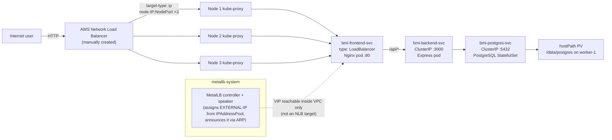
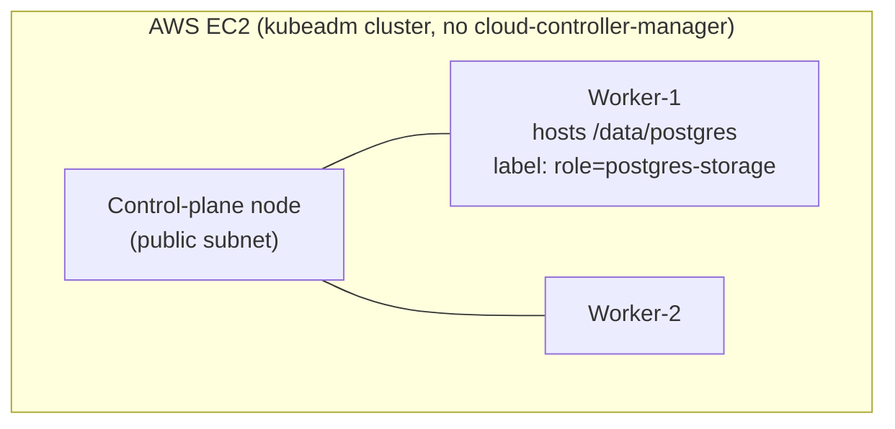

# BMI Health Tracker — MetalLB LoadBalancer Variant

Self-contained deployment guide for this folder only. Every command below is
runnable using just the contents of `k8s-LoadBalancer/` — no other sibling
`k8s-*` folder is required or referenced.

## 1. Overview

This folder deploys the **BMI Health Tracker**, a 3-tier web app, onto a
self-managed `kubeadm` Kubernetes cluster on AWS EC2, and exposes it via
**MetalLB** (giving the frontend `Service` a real in-cluster `EXTERNAL-IP`)
paired with a **manually-created AWS Network Load Balancer** that makes it
reachable from the internet.

**Tech stack**

| Layer | Technology |
|---|---|
| Frontend | React 18 + Vite, served by Nginx (proxies `/api/*` to the backend) |
| Backend | Node.js 18 + Express, `pg` driver |
| Database | PostgreSQL (StatefulSet, hostPath-backed PersistentVolume) |
| Container registry | AWS ECR (`bmi-backend`, `bmi-frontend` repos) |
| Cluster | kubeadm (containerd runtime), 1 control-plane + 2 workers, self-managed on EC2 (no EKS) |
| Ingress/exposure | `Service type: LoadBalancer` + **MetalLB** (L2/ARP mode) + a **manually-created AWS NLB** targeting each node's NodePort |
| Image pull auth | EC2 instance-profile role (`SSM`) via ECR credential provider / imagePullSecret |

**Architecture / traffic flow**





## 2. Focus of this folder

This variant's sole focus is: **3-tier app + Service `type: LoadBalancer`
fulfilled by MetalLB**, plus the manual step of wiring a real AWS NLB to the
node NodePorts so the app is internet-reachable — since MetalLB itself only
ever produces a private, in-VPC virtual IP.

Out of scope here: Ingress path-based routing (see the ingress variant), the
AWS Load Balancer Controller (see the LoadBalancer-annotations variant, where
Kubernetes provisions the real AWS NLB automatically), TLS for the app
itself, GitOps/ArgoCD.

## 3. What is MetalLB, and why here?

A `kubeadm` cluster on plain EC2 has **no cloud-controller-manager**, so
Kubernetes has no native way to satisfy `Service type: LoadBalancer` — it
would stay `Pending` forever. **MetalLB** plugs that gap by watching for
`LoadBalancer` Services and assigning each one a virtual IP (VIP) from a
configured `IPAddressPool`, then announcing that VIP on the local network
(**L2/ARP mode** here — the mode that works out of the box on a flat subnet
like an AWS VPC subnet, no BGP router peer required) so traffic to it reaches
whichever node currently "owns" the VIP.

**⚠️ Critical, confirmed-by-experience caveat:** the VIP MetalLB assigns is a
**private IP inside your VPC subnet that only becomes reachable via gratuitous
ARP** answered by whichever node currently owns it — a trick that works for a
real EC2 instance's kernel (it participates in genuine ARP resolution), but
**an AWS NLB is a managed service with no ARP resolution of its own**, so it
can never actually deliver a packet to that VIP. If you register the MetalLB
`EXTERNAL-IP` as an NLB target, it will sit permanently `unhealthy`. The fix
proven to work here: **target the NLB at the 3 nodes' real private IPs, each
on the frontend Service's `NodePort`** (target type `ip`, since these are
individual IPs rather than an Auto Scaling Group of instances) — `kube-proxy`
on whichever node receives the packet forwards it to a healthy frontend pod
regardless of which node currently owns the MetalLB VIP. The VIP itself is
still assigned and still useful for testing from inside the VPC — it's just
never what the NLB targets.

**Benefits**
- No extra IAM policy or Helm-installed controller pod reconciling AWS
  resources — MetalLB only ever talks to the Kubernetes API and the local
  network, nothing calls the AWS API.
- Gives every `LoadBalancer` Service a stable, predictable in-cluster VIP
  immediately, useful for internal/VPC-only access without touching AWS at
  all.
- Closest of the three exposure variants to "vanilla" Kubernetes behavior
  from the app's point of view (`Service type: LoadBalancer` "just works" at
  the cluster level).

**Costs / trade-offs**
- The VIP alone does **not** solve internet exposure — you still need a
  manually-created (and manually maintained) AWS NLB pointing at NodePorts,
  unlike the LoadBalancer-annotations variant where the real AWS NLB is
  fully automatic.
- The frontend Service's `NodePort` can change if the Service is ever deleted
  and recreated without pinning `nodePort:` explicitly — the NLB target group
  would then need updating.
- If a node is replaced (new private IP), the NLB target group must be
  updated manually.

Compared to the plain NodePort variant (simplest, one raw port on every node,
no in-cluster VIP at all) and the LoadBalancer-annotations variant (the only
one where Kubernetes manages the real AWS load balancer end-to-end), this
variant sits in the middle: Kubernetes manages an in-cluster VIP, but a human
still bridges it to the internet.

## 4. Implementation

### Prerequisites (apply to both A and B)

- A running kubeadm cluster (control-plane + ≥1 worker), e.g. provisioned by
  `provision-k8s-cluster.sh` from the `kubernetes-fundamentals` repo. That
  script writes `./k8s-cluster-state.env` on your **local laptop** with
  `MASTER_PUB_IP`, `MASTER_PRIV_IP`, `WORKER1_PRIV_IP`, `WORKER2_PRIV_IP`,
  `AWS_REGION`, `AWS_PROFILE` — source it (`source ./k8s-cluster-state.env`)
  wherever a command below needs one of those values. If you don't have that
  file, get the same information with:
  ```bash
  # on your laptop
  aws sts get-caller-identity --profile sarowar-ostad
  # on the master node
  kubectl get nodes -o wide
  ```
- **⚠️ Your AWS CLI profile's default region may not match your cluster's
  region** (e.g. profile default `us-west-2` while the cluster lives in
  `ap-south-1`) — always pass `--region` explicitly on every `aws ec2`/`aws
  elbv2` call below, or you'll get a misleading "not found" error instead of
  an auth error, even though the resource genuinely exists.
- All 3 EC2 instances share one IAM instance-profile **role — by convention
  named `SSM`** in this setup. Confirm its name once:
  ```bash
  # on your laptop, profile sarowar-ostad
  aws ec2 describe-instances --instance-ids <any-node-instance-id> \
    --profile sarowar-ostad --region ap-south-1 \
    --query 'Reservations[0].Instances[0].IamInstanceProfile.Arn' --output text
  aws iam list-instance-profiles --profile sarowar-ostad \
    --query "InstanceProfiles[?Arn=='<arn-from-above>'].Roles[0].RoleName" --output text
  ```
- **Manual, one-time, cannot be automated by any script here:** attach the
  AWS-managed policy `AmazonEC2ContainerRegistryReadOnly` to that role so
  the nodes can pull images from ECR:
  ```bash
  # on your laptop, profile sarowar-ostad
  aws iam attach-role-policy --role-name SSM \
    --policy-arn arn:aws:iam::aws:policy/AmazonEC2ContainerRegistryReadOnly \
    --profile sarowar-ostad
  ```
- Clone this repository **on the control-plane node** — every manual command
  below assumes you're running it from the repo root there:
  ```bash
  # on the master node
  git clone https://github.com/sarowar-alam/kubernetes-3tier-app.git
  cd kubernetes-3tier-app
  ```
- Docker images already built and pushed to ECR (`bmi-backend`,
  `bmi-frontend` repos) — from your laptop:
  ```bash
  # on your laptop
  bash k8s-LoadBalancer/build-and-push.sh
  ```

---

### A. With the automation script

1. **Choose and verify a free MetalLB address range**, on your laptop.
   [`metallb/ipaddresspool.yaml`](metallb/ipaddresspool.yaml) ships with a
   **guessed placeholder range** (`10.0.10.240-10.0.10.250`) — it must be
   inside your nodes' subnet CIDR and genuinely unused:
   ```bash
   # on your laptop, profile sarowar-ostad
   # 1) confirm your nodes' subnet CIDR
   aws ec2 describe-subnets --profile sarowar-ostad --region ap-south-1 \
     --subnet-ids <your-nodes-subnet-id> \
     --query 'Subnets[0].CidrBlock' --output text

   # 2) list every private IP already in use in that VPC (instances + ENIs)
   aws ec2 describe-network-interfaces --profile sarowar-ostad --region ap-south-1 \
     --query 'NetworkInterfaces[].PrivateIpAddress' --output table
   ```
   Pick a range inside that CIDR that appears in neither list, avoiding the
   first 4 and last 1 addresses of the block (AWS reserves those). Edit
   [`metallb/ipaddresspool.yaml`](metallb/ipaddresspool.yaml) accordingly
   before continuing.

2. **Deploy everything else — run on the control-plane node:**
   ```bash
   # on the master node
   bash k8s-LoadBalancer/deploy.sh
   ```
   First run prompts for the worker's private IP (hosting `/data/postgres`)
   and a PostgreSQL password; it then creates the namespace, labels the
   storage node, creates secrets, refreshes the ECR pull secret, deploys
   PostgreSQL → migrations → backend, **installs MetalLB** (chart version
   pinned via `METALLB_VERSION` in `metallb/install-metallb.sh`, plus the
   `IPAddressPool`/`L2Advertisement` from step 1), then deploys the frontend
   and waits for MetalLB to assign an `EXTERNAL-IP`. Subsequent runs are
   idempotent.

3. **Find the assigned `EXTERNAL-IP` and `NodePort`** — on the master node:
   ```bash
   # on the master node
   kubectl get svc bmi-frontend-svc -n bmi-app
   # EXTERNAL-IP column = the MetalLB VIP (VPC-internal only, not an NLB target)
   # PORT(S) column looks like 80:32305/TCP — 32305 is the NodePort you need next
   ```

4. **Create the AWS NLB — on your laptop, profile `sarowar-ostad`**, via
   [`create-nlb.sh`](create-nlb.sh). It targets the **3 nodes' private IPs on
   that NodePort**, not the MetalLB VIP (see the caveat in
   [§3](#3-what-is-metallb-and-why-here)), and is idempotent — safe to re-run
   after a redeploy without creating duplicate resources:
   ```bash
   # on your laptop, profile sarowar-ostad
   # find the nodes' shared security group once:
   aws ec2 describe-instances --instance-ids <any-node-instance-id> \
     --profile sarowar-ostad --region ap-south-1 \
     --query 'Reservations[0].Instances[0].SecurityGroups[0].GroupId' --output text

   # derive VPC_ID via subnet lookup if needed, see LoadBalancer-annotations/README.md §4
   export AWS_PROFILE=sarowar-ostad
   export AWS_REGION=ap-south-1
   export VPC_ID=<your-vpc-id>
   export NODEPORT=<nodeport-from-step-3>
   export PUBLIC_SUBNET_IDS="<public-subnet-id-1> <public-subnet-id-2>"
   export MASTER_IP=<master-private-ip>
   export WORKER1_IP=<worker-1-private-ip>
   export WORKER2_IP=<worker-2-private-ip>
   export NODES_SECURITY_GROUP_ID=<sg-id-from-above>

   bash k8s-LoadBalancer/create-nlb.sh
   ```
   This creates (or reuses) the target group + the 3 target registrations +
   the load balancer + the listener, opens the NodePort in the nodes'
   security group (scoped to the VPC CIDR by default — see `SG_CIDR` in the
   script header for the least-privilege rationale), and prints the target
   group ARN, load balancer ARN, and DNS name at the end.

   Wait ~2–3 minutes for target health checks to pass, then check:
   ```bash
   aws elbv2 describe-target-health --target-group-arn <TG_ARN-from-script-output> \
     --profile sarowar-ostad --region ap-south-1
   # Expected: all 3 targets State=healthy
   ```

5. **Get the app URL** — the NLB's DNS name printed by the script:
   ```bash
   curl http://<nlb-dns-name>/
   ```

> **The frontend `NodePort` is stable across routine `deploy.sh` /
> `build-and-push.sh` reruns** — it only changes if the Service is deleted
> and recreated without `nodePort:` pinned in the manifest, or if a node is
> replaced (new private IP). Neither requires touching the target group.

---

### B. Fully manual (no `deploy.sh`)

Run all of these **on the control-plane node**, inside the cloned repo
(`kubernetes-3tier-app/`), unless marked "on your laptop".

1. **Namespace:**
   ```bash
   kubectl apply -f k8s-LoadBalancer/namespace.yaml
   ```

2. **Storage node label** — find the worker that will host `/data/postgres`
   and label it (needed by `pv.yaml`/`statefulset.yaml` node affinity):
   ```bash
   kubectl get nodes -o wide
   kubectl label node <worker-1-node-name> role=postgres-storage --overwrite
   ```

3. **Create `/data/postgres` on that worker** (SSH from the master, or run
   the equivalent commands if you're already on that node):
   ```bash
   ssh ubuntu@<worker-1-private-ip> "sudo mkdir -p /data/postgres && sudo chmod 777 /data/postgres"
   ```

4. **Secrets** (`postgres-secret` used by the StatefulSet, `backend-secret`
   with the resulting connection string):
   ```bash
   kubectl create secret generic postgres-secret \
     --from-literal=POSTGRES_DB=bmidb \
     --from-literal=POSTGRES_USER=bmi_user \
     --from-literal=POSTGRES_PASSWORD='<choose-a-password>' \
     --namespace=bmi-app

   kubectl create secret generic backend-secret \
     --from-literal=DATABASE_URL='postgres://bmi_user:<same-password>@bmi-postgres-svc:5432/bmidb' \
     --namespace=bmi-app
   ```

5. **ECR image-pull secret** (expires every 12h — re-run whenever it's
   stale):
   ```bash
   bash k8s-LoadBalancer/setup-ecr-secret.sh
   ```

6. **PostgreSQL:**
   ```bash
   kubectl apply -f k8s-LoadBalancer/postgres/pv.yaml
   kubectl apply -f k8s-LoadBalancer/postgres/pvc.yaml
   kubectl apply -f k8s-LoadBalancer/postgres/statefulset.yaml
   kubectl apply -f k8s-LoadBalancer/postgres/service.yaml
   kubectl wait --for=condition=ready pod -l app=postgres -n bmi-app --timeout=120s
   ```

7. **Database migrations:**
   ```bash
   kubectl apply -f k8s-LoadBalancer/postgres/migrations-configmap.yaml
   kubectl delete job bmi-migrations -n bmi-app --ignore-not-found=true
   kubectl apply -f k8s-LoadBalancer/postgres/migration-job.yaml
   kubectl wait --for=condition=complete job/bmi-migrations -n bmi-app --timeout=90s
   ```

8. **Backend:**
   ```bash
   kubectl apply -f k8s-LoadBalancer/backend/configmap.yaml
   kubectl apply -f k8s-LoadBalancer/backend/deployment.yaml
   kubectl apply -f k8s-LoadBalancer/backend/service.yaml
   kubectl rollout status deployment/bmi-backend -n bmi-app --timeout=90s
   ```

9. **MetalLB** — must be installed **before** the frontend Service is
   created, otherwise it stays `Pending` until MetalLB catches up:
   ```bash
   METALLB_VERSION=v0.14.9
   kubectl apply -f "https://raw.githubusercontent.com/metallb/metallb/${METALLB_VERSION}/config/manifests/metallb-native.yaml"
   kubectl rollout status deployment/controller -n metallb-system --timeout=120s
   kubectl rollout status daemonset/speaker    -n metallb-system --timeout=120s

   # confirm the IP range in metallb/ipaddresspool.yaml is verified free (Part A, step 1) before this:
   kubectl apply -f k8s-LoadBalancer/metallb/ipaddresspool.yaml
   kubectl apply -f k8s-LoadBalancer/metallb/l2advertisement.yaml
   ```

10. **Frontend:**
    ```bash
    kubectl apply -f k8s-LoadBalancer/frontend/deployment.yaml
    kubectl apply -f k8s-LoadBalancer/frontend/service.yaml
    kubectl rollout status deployment/bmi-frontend -n bmi-app --timeout=90s
    ```

11. **Wait for MetalLB to assign an `EXTERNAL-IP`, then note the
    `NodePort`:**
    ```bash
    kubectl get svc bmi-frontend-svc -n bmi-app -w
    # EXTERNAL-IP column becomes the MetalLB VIP once ready
    # PORT(S) column shows the NodePort, e.g. 80:32305/TCP
    ```

12. **Create the AWS NLB** — same procedure as Part A, step 4
    ([`create-nlb.sh`](create-nlb.sh), targeting the 3 nodes' private IPs on
    the NodePort found above, **not** the MetalLB VIP), then verify with
    Part A, step 5.

## 5. Teardown

### Step 1 — AWS-side (run from your local laptop, profile `sarowar-ostad`)

Delete the NLB first, so nothing keeps referencing the target group or
security group rule below. Re-derive the ARNs by name — the `TG_ARN`/`LB_ARN`
shell variables from creation almost certainly aren't set in your current
shell session:
```bash
# on your laptop, profile sarowar-ostad
TG_ARN=$(aws elbv2 describe-target-groups --names bmi-frontend-tg \
  --profile sarowar-ostad --region ap-south-1 \
  --query 'TargetGroups[0].TargetGroupArn' --output text)
LB_ARN=$(aws elbv2 describe-load-balancers --names bmi-frontend-nlb \
  --profile sarowar-ostad --region ap-south-1 \
  --query 'LoadBalancers[0].LoadBalancerArn' --output text)

aws elbv2 describe-listeners --load-balancer-arn "${LB_ARN}" \
  --profile sarowar-ostad --region ap-south-1 --query 'Listeners[].ListenerArn' --output text \
  | xargs -n1 -I{} aws elbv2 delete-listener --listener-arn {} --profile sarowar-ostad --region ap-south-1

aws elbv2 delete-load-balancer --load-balancer-arn "${LB_ARN}" \
  --profile sarowar-ostad --region ap-south-1

# wait ~1-2 minutes for the NLB to fully delete before removing its target group
aws elbv2 delete-target-group --target-group-arn "${TG_ARN}" \
  --profile sarowar-ostad --region ap-south-1
```

If [`create-nlb.sh`](create-nlb.sh) opened a security-group rule for the
NodePort, revoke it (same `NODEPORT`/`NODES_SECURITY_GROUP_ID`/`SG_CIDR`
values used to create it):
```bash
aws ec2 revoke-security-group-ingress \
  --group-id <nodes-security-group-id> \
  --protocol tcp --port <nodeport> --cidr <vpc-cidr> \
  --profile sarowar-ostad --region ap-south-1
```

### Step 2 — cluster-side (run on the control-plane node)

```bash
kubectl delete -f k8s-LoadBalancer/frontend/service.yaml --ignore-not-found=true
kubectl delete -f k8s-LoadBalancer/frontend/deployment.yaml --ignore-not-found=true
kubectl delete -f k8s-LoadBalancer/postgres/migration-job.yaml --ignore-not-found=true
kubectl delete -f k8s-LoadBalancer/backend/service.yaml --ignore-not-found=true
kubectl delete -f k8s-LoadBalancer/backend/deployment.yaml --ignore-not-found=true
kubectl delete -f k8s-LoadBalancer/backend/configmap.yaml --ignore-not-found=true
kubectl delete -f k8s-LoadBalancer/postgres/service.yaml --ignore-not-found=true
kubectl delete -f k8s-LoadBalancer/postgres/statefulset.yaml --ignore-not-found=true
kubectl delete -f k8s-LoadBalancer/postgres/pvc.yaml --ignore-not-found=true
# PV's Retain policy means /data/postgres itself survives — delete the PV
# object only if you also want to release the reclaim record:
kubectl delete -f k8s-LoadBalancer/postgres/pv.yaml --ignore-not-found=true

# Remove MetalLB entirely (controller, speaker, CRDs, and this app's pool/L2Advertisement)
METALLB_VERSION=v0.14.9
kubectl delete -f k8s-LoadBalancer/metallb/l2advertisement.yaml --ignore-not-found=true
kubectl delete -f k8s-LoadBalancer/metallb/ipaddresspool.yaml --ignore-not-found=true
kubectl delete -f "https://raw.githubusercontent.com/metallb/metallb/${METALLB_VERSION}/config/manifests/metallb-native.yaml" --ignore-not-found=true

# optional — only if nothing else in the cluster still needs it
kubectl delete namespace bmi-app --ignore-not-found=true
```

If you also attached `AmazonEC2ContainerRegistryReadOnly` to role `SSM`
solely for this deployment and no longer need ECR pulls from these nodes,
detach it too:
```bash
aws iam detach-role-policy --role-name SSM \
  --policy-arn arn:aws:iam::aws:policy/AmazonEC2ContainerRegistryReadOnly \
  --profile sarowar-ostad
```
