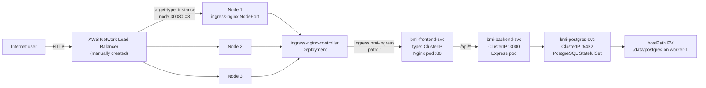
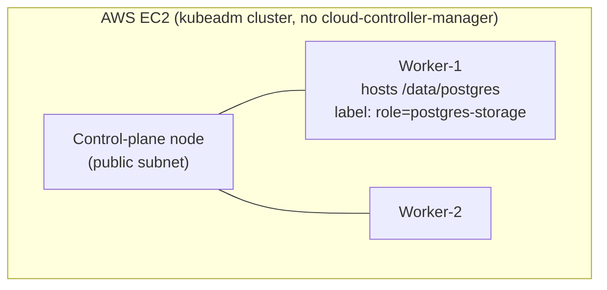

# BMI Health Tracker — Ingress-Nginx Variant

Self-contained deployment guide for this folder only. Every command below is
runnable using just the contents of `k8s-ingress/` — no other sibling
`k8s-*` folder is required or referenced.

## 1. Overview

This folder deploys the **BMI Health Tracker**, a 3-tier web app, onto a
self-managed `kubeadm` Kubernetes cluster on AWS EC2, and exposes it via the
**ingress-nginx controller** (an `Ingress` resource routing to a `ClusterIP`
frontend Service) paired with a **manually-created AWS Network Load
Balancer** that makes it reachable from the internet.

**Tech stack**

| Layer | Technology |
|---|---|
| Frontend | React 18 + Vite, served by Nginx (proxies `/api/*` to the backend) |
| Backend | Node.js 18 + Express, `pg` driver |
| Database | PostgreSQL (StatefulSet, hostPath-backed PersistentVolume) |
| Container registry | AWS ECR (`bmi-backend`, `bmi-frontend` repos) |
| Cluster | kubeadm (containerd runtime), 1 control-plane + 2 workers, self-managed on EC2 (no EKS) |
| Ingress/exposure | **ingress-nginx controller** (bare-metal manifest, `Service type: NodePort` pinned to `30080`) + `Ingress` resource + a **manually-created AWS NLB** targeting each node on that NodePort |
| Image pull auth | EC2 instance-profile role (`SSM`) via ECR credential provider / imagePullSecret |

**Architecture / traffic flow**





## 2. Focus of this folder

This variant's sole focus is: **L7 routing inside the cluster via
`ingress-nginx`**, using a single `Ingress` resource as the one place that
maps incoming paths to backend Services — the foundation you'd build on for
host-based routing, multiple apps behind one entry point, or TLS
termination later, none of which a plain NodePort or a MetalLB VIP give you
on their own.

Out of scope here: MetalLB's floating in-cluster VIP (see the LoadBalancer
variant), the AWS Load Balancer Controller automating the AWS side (see the
LoadBalancer-annotations variant), TLS for the app itself, GitOps/ArgoCD,
any host- or path-based routing rules beyond the single catch-all `/` rule
this app needs.

## 3. What is ingress-nginx, and why here?

A `kubeadm` cluster on plain EC2 has **no cloud-controller-manager**, so
there's no built-in Ingress controller and `Service type: LoadBalancer`
would stay `Pending` forever. **ingress-nginx** fills that gap as a
self-hosted controller: it runs as a normal `Deployment` (a pod running
Nginx configured dynamically from `Ingress` objects), fronted here by its
own `Service type: NodePort` pinned to **`30080`** (the bare-metal install
manifest this repo uses has no cloud LB to attach to either, so it falls
back to NodePort just like the plain `k8s/` variant does for the app
itself). Every HTTP request that reaches any node on port `30080` is
handled by whichever node's ingress-nginx pod receives it, which then
looks at the `Ingress` resource ([`ingress/bmi-ingress.yaml`](ingress/bmi-ingress.yaml))
to decide where to route it — in this app's case, a single catch-all
`path: /` rule forwarding everything to `bmi-frontend-svc`.

**Benefits**
- A single, consistent entry point (NodePort `30080`) that can front many
  apps/paths/hosts through `Ingress` objects, instead of needing a unique
  NodePort per Service the way the plain `k8s/` variant does.
- Sets up the natural place to add TLS termination (e.g. via `cert-manager`)
  or host-based routing later, without touching the frontend Service at all.
- The frontend Service itself becomes a plain internal `ClusterIP` — no
  NodePort/VIP management on the app's own Service.

**Costs / trade-offs**
- Getting traffic from the internet to that NodePort `30080` is **still a
  fully manual step** — exactly like the plain `k8s/` variant, this repo has
  no cloud-controller-manager to provision a real load balancer
  automatically, so an AWS NLB has to be created and pointed at all 3 nodes'
  `30080` by hand (see [§4](#4-implementation) below). Compare to the
  LoadBalancer-annotations variant, where Kubernetes provisions and manages
  that same AWS NLB for you.
- One more moving part running in the cluster (`ingress-nginx-controller`
  Deployment + its own Service/pods) versus the plain NodePort variant's
  zero extra components.
- This app only needs a single `/` rule, so none of ingress-nginx's real
  routing power (multiple hosts/paths, rewrite rules, TLS) is actually
  exercised here — it's included to demonstrate the pattern.

Compared to the plain NodePort variant (`k8s/`, simplest, one raw port,
no L7 routing at all), MetalLB (`k8s-LoadBalancer/`, a floating in-cluster
VIP instead of L7 routing), and the LoadBalancer-annotations variant
(`k8s-LoadBalancer-annotations/`, the only one where the real AWS NLB is
fully automatic): this variant is the one that demonstrates Kubernetes-native
L7 routing, at the cost of the same manual AWS step the plain NodePort
variant also requires.

## 4. Implementation

### Prerequisites (apply to both A and B)

- A running kubeadm cluster (control-plane + ≥1 worker), e.g. provisioned by
  `provision-k8s-cluster.sh` from the `kubernetes-fundamentals` repo. That
  script writes `./k8s-cluster-state.env` on your **local laptop** with
  `MASTER_PUB_IP`, `MASTER_PRIV_IP`, `WORKER1_PRIV_IP`, `WORKER2_PRIV_IP`,
  `AWS_REGION`, `AWS_PROFILE` — source it (`source ./k8s-cluster-state.env`)
  wherever a command below needs one of those values. If you don't have that
  file, get the same information with:
  ```bash
  # on your laptop
  aws sts get-caller-identity --profile sarowar-ostad
  # on the master node
  kubectl get nodes -o wide
  ```
- **⚠️ Your AWS CLI profile's default region may not match your cluster's
  region** (e.g. profile default `us-west-2` while the cluster lives in
  `ap-south-1`) — always pass `--region` explicitly on every `aws ec2`/`aws
  elbv2` call below, or you'll get a misleading "not found" error instead of
  an auth error, even though the resource genuinely exists.
- All 3 EC2 instances share one IAM instance-profile **role — by convention
  named `SSM`** in this setup. Confirm its name once:
  ```bash
  # on your laptop, profile sarowar-ostad
  aws ec2 describe-instances --instance-ids <any-node-instance-id> \
    --profile sarowar-ostad --region ap-south-1 \
    --query 'Reservations[0].Instances[0].IamInstanceProfile.Arn' --output text
  aws iam list-instance-profiles --profile sarowar-ostad \
    --query "InstanceProfiles[?Arn=='<arn-from-above>'].Roles[0].RoleName" --output text
  ```
- **Manual, one-time, cannot be automated by any script here:** attach the
  AWS-managed policy `AmazonEC2ContainerRegistryReadOnly` to that role so
  the nodes can pull images from ECR:
  ```bash
  # on your laptop, profile sarowar-ostad
  aws iam attach-role-policy --role-name SSM \
    --policy-arn arn:aws:iam::aws:policy/AmazonEC2ContainerRegistryReadOnly \
    --profile sarowar-ostad
  ```
- **Manual, one-time:** open NodePort `30080` on the nodes' shared security
  group — the NLB you'll create in step A.3/B.11 forwards the client's real
  source IP straight through, it has no security group of its own:
  ```bash
  # on your laptop, profile sarowar-ostad
  aws ec2 describe-instances --instance-ids <any-node-instance-id> \
    --profile sarowar-ostad --region ap-south-1 \
    --query 'Reservations[0].Instances[0].SecurityGroups[0].GroupId' --output text

  aws ec2 authorize-security-group-ingress \
    --group-id <sg-id-from-above> \
    --protocol tcp --port 30080 --cidr 0.0.0.0/0 \
    --profile sarowar-ostad --region ap-south-1
  ```
- **SSH agent forwarding** — `deploy.sh` SSHes from the master into worker-1
  to create `/data/postgres`. All 3 nodes share the same EC2 key pair, but
  the private key lives on your **local** machine, not the master, so you
  must forward your local agent when connecting or that step fails with
  `Permission denied (publickey)`:
  ```bash
  # on your laptop, before SSHing in
  eval "$(ssh-agent -s)"
  ssh-add /path/to/your-key.pem
  ssh -A ubuntu@<master-public-ip>   # -A forwards the agent to the master
  ```
- Clone this repository **on the control-plane node** — every manual command
  below assumes you're running it from the repo root there:
  ```bash
  # on the master node
  git clone https://github.com/sarowar-alam/kubernetes-3tier-app.git
  cd kubernetes-3tier-app
  ```
- Docker images already built and pushed to ECR (`bmi-backend`,
  `bmi-frontend` repos) — from your laptop:
  ```bash
  # on your laptop
  bash k8s-ingress/build-and-push.sh
  ```

---

### A. With the automation script

1. **Deploy everything — run on the control-plane node:**
   ```bash
   # on the master node
   bash k8s-ingress/deploy.sh
   ```
   First run prompts for the worker's private IP (hosting `/data/postgres`)
   and a PostgreSQL password; it then creates the namespace, labels the
   storage node, creates secrets, refreshes the ECR pull secret, deploys
   PostgreSQL → migrations → backend, **installs ingress-nginx**
   ([`ingress/install-ingress-nginx.sh`](ingress/install-ingress-nginx.sh) —
   applies the bare-metal manifest, waits for its rollout, then pins its
   Service's `http` port to NodePort `30080`), then deploys the `ClusterIP`
   frontend Service and the `Ingress` resource. Subsequent runs are
   idempotent.

2. **Verify ingress-nginx and the app, on the master node:**
   ```bash
   kubectl get pods -n ingress-nginx
   # Expected: ingress-nginx-controller-xxxxx   1/1   Running

   kubectl get svc -n ingress-nginx ingress-nginx-controller
   # Expected: TYPE=NodePort   PORT(S)=80:30080/TCP,443:xxxxx/TCP

   kubectl get ingress -n bmi-app
   # Expected: bmi-ingress   nginx   *   <node-ip(s)>   80

   curl http://<any-node-ip>:30080/
   ```

3. **Create the AWS NLB — on your laptop, profile `sarowar-ostad`.** Unlike
   the MetalLB variant, this target group uses **target-type `instance`**
   (registering the 3 EC2 instance IDs directly) rather than `ip`, since
   there's no floating VIP here to route around — every node's own
   `ingress-nginx` NodePort `30080` answers regardless of which node's pod
   handles the request:
   ```bash
   # on your laptop, profile sarowar-ostad
   VPC_ID=<your-vpc-id>
   PUBLIC_SUBNET_A=<public-subnet-id-1>   # e.g. ap-south-1a
   PUBLIC_SUBNET_B=<public-subnet-id-2>   # e.g. ap-south-1b
   MASTER_ID=<master-instance-id>
   WORKER1_ID=<worker-1-instance-id>
   WORKER2_ID=<worker-2-instance-id>

   # Target group — type Instance, TCP:30080, HTTP health check on "/"
   TG_ARN=$(aws elbv2 create-target-group \
     --name bmi-ingress-tg --protocol TCP --port 30080 --vpc-id "$VPC_ID" \
     --target-type instance \
     --health-check-protocol HTTP --health-check-path / --health-check-port 30080 \
     --profile sarowar-ostad --region ap-south-1 \
     --query 'TargetGroups[0].TargetGroupArn' --output text)

   # Register all 3 nodes — NodePort 30080 is open on every node regardless
   # of which one the ingress-nginx pod lands on
   aws elbv2 register-targets --target-group-arn "$TG_ARN" \
     --targets Id=$MASTER_ID Id=$WORKER1_ID Id=$WORKER2_ID \
     --profile sarowar-ostad --region ap-south-1

   # Internet-facing Network Load Balancer, spanning both public subnets
   LB_ARN=$(aws elbv2 create-load-balancer \
     --name bmi-ingress-nlb --type network --scheme internet-facing \
     --subnets "$PUBLIC_SUBNET_A" "$PUBLIC_SUBNET_B" \
     --profile sarowar-ostad --region ap-south-1 \
     --query 'LoadBalancers[0].LoadBalancerArn' --output text)

   # Listener — TCP port 80 -> forward to the target group above
   aws elbv2 create-listener --load-balancer-arn "$LB_ARN" \
     --protocol TCP --port 80 \
     --default-actions Type=forward,TargetGroupArn="$TG_ARN" \
     --profile sarowar-ostad --region ap-south-1
   ```
   Wait ~1-2 minutes for targets to go `healthy`, then get the DNS name:
   ```bash
   aws elbv2 describe-target-health --target-group-arn "$TG_ARN" \
     --profile sarowar-ostad --region ap-south-1 \
     --query 'TargetHealthDescriptions[].[Target.Id,TargetHealth.State]' --output table

   aws elbv2 describe-load-balancers --load-balancer-arns "$LB_ARN" \
     --profile sarowar-ostad --region ap-south-1 \
     --query 'LoadBalancers[0].DNSName' --output text
   ```

4. **Test:**
   ```bash
   curl http://<nlb-dns-name>/
   curl http://<nlb-dns-name>/api/measurements
   ```

> **The ingress-nginx NodePort (`30080`) is stable across routine
> `deploy.sh`/`build-and-push.sh` reruns** — it's pinned by
> `install-ingress-nginx.sh` and only needs re-registering with the target
> group if a **node** is replaced (new instance ID) or the NLB itself is
> recreated.

---

### B. Fully manual (no `deploy.sh`)

Run all of these **on the control-plane node**, inside the cloned repo
(`kubernetes-3tier-app/`), unless marked "on your laptop".

1. **Namespace:**
   ```bash
   kubectl apply -f k8s-ingress/namespace.yaml
   ```

2. **Storage node label** — find the worker that will host `/data/postgres`
   and label it (needed by `pv.yaml`/`statefulset.yaml` node affinity):
   ```bash
   kubectl get nodes -o wide
   kubectl label node <worker-1-node-name> role=postgres-storage --overwrite
   ```

3. **Create `/data/postgres` on that worker** (SSH from the master, or run
   the equivalent commands if you're already on that node):
   ```bash
   ssh ubuntu@<worker-1-private-ip> "sudo mkdir -p /data/postgres && sudo chmod 777 /data/postgres"
   ```

4. **Secrets** (`postgres-secret` used by the StatefulSet, `backend-secret`
   with the resulting connection string):
   ```bash
   kubectl create secret generic postgres-secret \
     --from-literal=POSTGRES_DB=bmidb \
     --from-literal=POSTGRES_USER=bmi_user \
     --from-literal=POSTGRES_PASSWORD='<choose-a-password>' \
     --namespace=bmi-app

   kubectl create secret generic backend-secret \
     --from-literal=DATABASE_URL='postgres://bmi_user:<same-password>@bmi-postgres-svc:5432/bmidb' \
     --namespace=bmi-app
   ```

5. **ECR image-pull secret** (expires every 12h — re-run whenever it's
   stale):
   ```bash
   bash k8s-ingress/setup-ecr-secret.sh
   ```

6. **PostgreSQL:**
   ```bash
   kubectl apply -f k8s-ingress/postgres/pv.yaml
   kubectl apply -f k8s-ingress/postgres/pvc.yaml
   kubectl apply -f k8s-ingress/postgres/statefulset.yaml
   kubectl apply -f k8s-ingress/postgres/service.yaml
   kubectl wait --for=condition=ready pod -l app=postgres -n bmi-app --timeout=120s
   ```

7. **Database migrations:**
   ```bash
   kubectl apply -f k8s-ingress/postgres/migrations-configmap.yaml
   kubectl delete job bmi-migrations -n bmi-app --ignore-not-found=true
   kubectl apply -f k8s-ingress/postgres/migration-job.yaml
   kubectl wait --for=condition=complete job/bmi-migrations -n bmi-app --timeout=90s
   ```

8. **Backend:**
   ```bash
   kubectl apply -f k8s-ingress/backend/configmap.yaml
   kubectl apply -f k8s-ingress/backend/deployment.yaml
   kubectl apply -f k8s-ingress/backend/service.yaml
   kubectl rollout status deployment/bmi-backend -n bmi-app --timeout=90s
   ```

9. **ingress-nginx controller** — must be installed **before** the frontend
   Ingress can route anywhere useful:
   ```bash
   INGRESS_NGINX_VERSION=controller-v1.11.3
   kubectl apply -f "https://raw.githubusercontent.com/kubernetes/ingress-nginx/${INGRESS_NGINX_VERSION}/deploy/static/provider/baremetal/deploy.yaml"

   kubectl rollout status deployment/ingress-nginx-controller -n ingress-nginx --timeout=120s

   # Pin the http port to NodePort 30080 — full ports replace keeps http/https
   # internally consistent regardless of upstream manifest ordering
   kubectl patch svc ingress-nginx-controller -n ingress-nginx --type=merge -p '{
     "spec": {
       "ports": [
         {"name": "http",  "port": 80,  "targetPort": "http",  "protocol": "TCP", "nodePort": 30080},
         {"name": "https", "port": 443, "targetPort": "https", "protocol": "TCP"}
       ]
     }
   }'
   ```

10. **Frontend (ClusterIP) + Ingress:**
    ```bash
    kubectl apply -f k8s-ingress/frontend/deployment.yaml
    kubectl apply -f k8s-ingress/frontend/service.yaml
    kubectl rollout status deployment/bmi-frontend -n bmi-app --timeout=90s

    kubectl apply -f k8s-ingress/ingress/bmi-ingress.yaml
    ```

11. **Verify:**
    ```bash
    kubectl get pods -n ingress-nginx
    # Expected: ingress-nginx-controller-xxxxx   1/1   Running

    kubectl get svc -n ingress-nginx ingress-nginx-controller
    # Expected: TYPE=NodePort   PORT(S)=80:30080/TCP,443:xxxxx/TCP

    kubectl get ingress -n bmi-app
    # Expected: bmi-ingress   nginx   *   <node-ip(s)>   80

    kubectl get svc -n bmi-app bmi-frontend-svc
    # Expected: TYPE=ClusterIP (no NodePort)

    curl http://<any-node-ip>:30080/
    ```

12. **Create the AWS NLB** — same procedure as Part A, step 3 (target-type
    `instance`, targeting all 3 EC2 instance IDs on NodePort `30080`), then
    verify with Part A, step 4.

## 5. Teardown

Reverse order: remove the app + ingress-nginx from the cluster first, then
delete the AWS-side NLB/target group — this avoids leaving dead targets
registered against a target group nothing points to anymore.

### Step 1 — cluster-side (run on the control-plane node)

```bash
NAMESPACE=bmi-app

kubectl delete -f k8s-ingress/ingress/bmi-ingress.yaml --ignore-not-found=true
kubectl delete -f k8s-ingress/frontend/service.yaml --ignore-not-found=true
kubectl delete -f k8s-ingress/frontend/deployment.yaml --ignore-not-found=true

# Remove ingress-nginx entirely
INGRESS_NGINX_VERSION=controller-v1.11.3
kubectl delete -f "https://raw.githubusercontent.com/kubernetes/ingress-nginx/${INGRESS_NGINX_VERSION}/deploy/static/provider/baremetal/deploy.yaml" --ignore-not-found=true

kubectl delete -f k8s-ingress/backend/service.yaml --ignore-not-found=true
kubectl delete -f k8s-ingress/backend/deployment.yaml --ignore-not-found=true
kubectl delete -f k8s-ingress/backend/configmap.yaml --ignore-not-found=true

kubectl delete job bmi-migrations -n "$NAMESPACE" --ignore-not-found=true
kubectl delete -f k8s-ingress/postgres/migrations-configmap.yaml --ignore-not-found=true

kubectl delete -f k8s-ingress/postgres/service.yaml --ignore-not-found=true
kubectl delete -f k8s-ingress/postgres/statefulset.yaml --ignore-not-found=true
kubectl delete -f k8s-ingress/postgres/pvc.yaml --ignore-not-found=true
# PV's Retain policy means /data/postgres itself survives — delete the PV
# object only if you also want to release the reclaim record:
kubectl delete -f k8s-ingress/postgres/pv.yaml --ignore-not-found=true

kubectl delete secret postgres-secret backend-secret ecr-credentials -n "$NAMESPACE" --ignore-not-found=true
kubectl delete namespace "$NAMESPACE" --ignore-not-found=true

kubectl label node <worker-1-node-name> role- 2>/dev/null || true
```

**Verify:**
```bash
kubectl get namespace bmi-app
# Expected: Error from server (NotFound) — namespace fully removed

kubectl get pv,pvc -A
# Expected: no bmi-app resources listed
```

### Step 2 — AWS-side (run from your local laptop, profile `sarowar-ostad`)

Delete the NLB and listener first, wait for full deletion, then remove the
target group — a target group still attached to a deleting load balancer
can't be removed:
```bash
# on your laptop, profile sarowar-ostad
LB_ARN=$(aws elbv2 describe-load-balancers --names bmi-ingress-nlb \
  --profile sarowar-ostad --region ap-south-1 \
  --query 'LoadBalancers[0].LoadBalancerArn' --output text)

aws elbv2 describe-listeners --load-balancer-arn "$LB_ARN" \
  --profile sarowar-ostad --region ap-south-1 \
  --query 'Listeners[].ListenerArn' --output text | \
  xargs -n1 -I{} aws elbv2 delete-listener --profile sarowar-ostad --region ap-south-1 --listener-arn {}

aws elbv2 delete-load-balancer --load-balancer-arn "$LB_ARN" \
  --profile sarowar-ostad --region ap-south-1

aws elbv2 wait load-balancers-deleted --load-balancer-arns "$LB_ARN" \
  --profile sarowar-ostad --region ap-south-1

TG_ARN=$(aws elbv2 describe-target-groups --names bmi-ingress-tg \
  --profile sarowar-ostad --region ap-south-1 \
  --query 'TargetGroups[0].TargetGroupArn' --output text)
aws elbv2 delete-target-group --target-group-arn "$TG_ARN" \
  --profile sarowar-ostad --region ap-south-1
```

> **Leave the NodePort `30080` security-group rule in place** if you plan to
> deploy the plain `k8s/` variant next — it reuses the exact same port. Only
> remove it once no variant using NodePort `30080` is running:
> ```bash
> aws ec2 revoke-security-group-ingress \
>   --group-id <sg-id> \
>   --protocol tcp --port 30080 --cidr 0.0.0.0/0 \
>   --profile sarowar-ostad --region ap-south-1
> ```

**Verify:**
```bash
aws elbv2 describe-load-balancers --names bmi-ingress-nlb --profile sarowar-ostad --region ap-south-1
# Expected: An error occurred (LoadBalancerNotFound) ...

aws elbv2 describe-target-groups --names bmi-ingress-tg --profile sarowar-ostad --region ap-south-1
# Expected: An error occurred (TargetGroupNotFound) ...
```

If you also attached `AmazonEC2ContainerRegistryReadOnly` to role `SSM`
solely for this deployment and no longer need ECR pulls from these nodes,
detach it too:
```bash
aws iam detach-role-policy --role-name SSM \
  --policy-arn arn:aws:iam::aws:policy/AmazonEC2ContainerRegistryReadOnly \
  --profile sarowar-ostad
```
