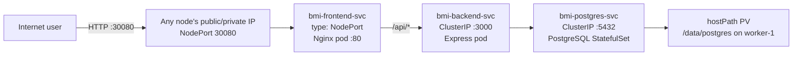
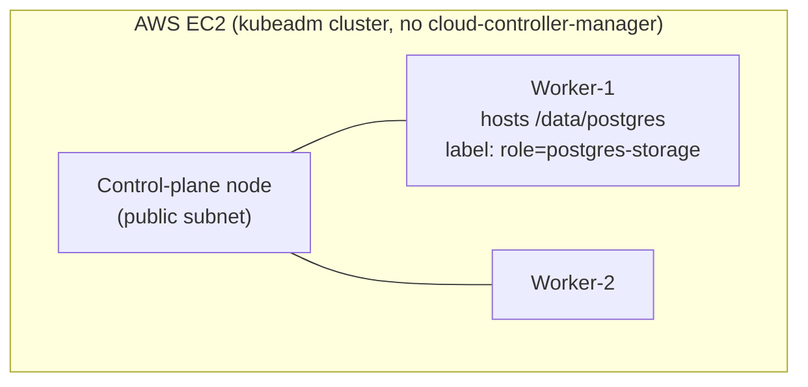

# BMI Health Tracker — Plain NodePort Variant

Self-contained deployment guide for this folder only. Every command below is
runnable using just the contents of `k8s/` — no other sibling `k8s-*` folder
is required or referenced.

## 1. Overview

This folder deploys the **BMI Health Tracker**, a 3-tier web app, onto a
self-managed `kubeadm` Kubernetes cluster on AWS EC2, and exposes it the
simplest way Kubernetes offers on a cluster with no cloud-controller-manager:
a plain **`Service type: NodePort`**, reachable directly on every node's IP.

**Tech stack**

| Layer | Technology |
|---|---|
| Frontend | React 18 + Vite, served by Nginx (proxies `/api/*` to the backend) |
| Backend | Node.js 18 + Express, `pg` driver |
| Database | PostgreSQL (StatefulSet, hostPath-backed PersistentVolume) |
| Container registry | AWS ECR (`bmi-backend`, `bmi-frontend` repos) |
| Cluster | kubeadm (containerd runtime), 1 control-plane + 2 workers, self-managed on EC2 (no EKS) |
| Ingress/exposure | `Service type: NodePort` — the frontend Service opens port `30080` on every node |
| Image pull auth | EC2 instance-profile role (`SSM`) via ECR credential provider / imagePullSecret |

**Architecture / traffic flow**





## 2. Focus of this folder

This variant's sole focus is: the **simplest possible way** to reach a
Service from outside a self-managed cluster — a raw `NodePort`, with zero
extra components installed. It's the baseline every other exposure variant
in this repo (MetalLB, ingress-nginx, the AWS Load Balancer Controller)
builds on or compares against.

Out of scope here: any form of in-cluster load balancing or L7 routing (see
the ingress variant), a floating in-cluster virtual IP (see the MetalLB
variant), a Kubernetes-managed real AWS load balancer (see the
LoadBalancer-annotations variant), TLS for the app itself, GitOps/ArgoCD.

## 3. What is a NodePort Service, and why here?

A `kubeadm` cluster on plain EC2 has **no cloud-controller-manager**, so
`Service type: LoadBalancer` has nothing to fulfill it and stays `Pending`
forever, and there's no managed Ingress controller pre-installed either.
**`Service type: NodePort`** is the one Service type that always works,
everywhere, with zero extra components: Kubernetes reserves a port (default
range `30000-32767`, pinned here to **`30080`**) and opens it on **every
node's network interface**, regardless of which node actually runs a
frontend pod. `kube-proxy` on whichever node receives the connection
forwards it to a healthy pod behind the Service.

**Benefits**
- Zero extra moving parts — no controller pod, no CRDs, no calls to the AWS
  API from inside the cluster at all.
- Works immediately on any bare kubeadm cluster, no installation step.
- Simplest possible mental model: one port, opened everywhere, forwarded by
  `kube-proxy`.

**Costs / trade-offs**
- No single stable DNS name — you reach the app via **one specific node's**
  IP (typically the control-plane's public IP); if that instance is
  replaced, the address changes and every client/bookmark breaks.
- An ugly high port (`30080`) instead of `80`/`443` — nothing in this stack
  translates it to a friendly URL (compare to the ingress-nginx variant,
  which still ends in a NodePort but at least consolidates all routing
  behind it, or the LoadBalancer variants, which put a real load balancer
  with a DNS name and port `80` in front).
- The port is open on **every** node's security group regardless of whether
  that node currently runs a frontend pod that moment — a slightly larger
  attack surface than strictly necessary.
- No host/path-based routing, no TLS termination point — this Service only
  ever fronts this one app on this one port.

Compared to the other variants in this repo: MetalLB (`k8s-LoadBalancer/`)
adds a floating in-cluster virtual IP on top of a NodePort; ingress-nginx
(`k8s-ingress/`) adds L7 host/path routing behind a NodePort; the AWS Load
Balancer Controller (`k8s-LoadBalancer-annotations/`) replaces the manual
AWS steps entirely with a Kubernetes-managed real NLB. This variant has none
of that — it's the rawest, simplest baseline.

## 4. Implementation

### Prerequisites (apply to both A and B)

- A running kubeadm cluster (control-plane + ≥1 worker), e.g. provisioned by
  `provision-k8s-cluster.sh` from the `kubernetes-fundamentals` repo. That
  script writes `./k8s-cluster-state.env` on your **local laptop** with
  `MASTER_PUB_IP`, `MASTER_PRIV_IP`, `WORKER1_PRIV_IP`, `WORKER2_PRIV_IP`,
  `AWS_REGION`, `AWS_PROFILE` — source it (`source ./k8s-cluster-state.env`)
  wherever a command below needs one of those values. If you don't have that
  file, get the same information with:
  ```bash
  # on your laptop
  aws sts get-caller-identity --profile sarowar-ostad
  # on the master node
  kubectl get nodes -o wide
  ```
- **⚠️ Your AWS CLI profile's default region may not match your cluster's
  region** (e.g. profile default `us-west-2` while the cluster lives in
  `ap-south-1`) — always pass `--region` explicitly on every `aws ec2` call
  below, or you'll get a misleading "not found" error instead of an auth
  error, even though the resource genuinely exists.
- All 3 EC2 instances share one IAM instance-profile **role — by convention
  named `SSM`** in this setup. Confirm its name once:
  ```bash
  # on your laptop, profile sarowar-ostad
  aws ec2 describe-instances --instance-ids <any-node-instance-id> \
    --profile sarowar-ostad --region ap-south-1 \
    --query 'Reservations[0].Instances[0].IamInstanceProfile.Arn' --output text
  aws iam list-instance-profiles --profile sarowar-ostad \
    --query "InstanceProfiles[?Arn=='<arn-from-above>'].Roles[0].RoleName" --output text
  ```
- **Manual, one-time, cannot be automated by any script here:** attach the
  AWS-managed policy `AmazonEC2ContainerRegistryReadOnly` to that role so
  the nodes can pull images from ECR:
  ```bash
  # on your laptop, profile sarowar-ostad
  aws iam attach-role-policy --role-name SSM \
    --policy-arn arn:aws:iam::aws:policy/AmazonEC2ContainerRegistryReadOnly \
    --profile sarowar-ostad
  ```
- **Manual, one-time:** open NodePort `30080` on the nodes' shared security
  group so it's reachable from the internet:
  ```bash
  # on your laptop, profile sarowar-ostad
  aws ec2 describe-instances --instance-ids <any-node-instance-id> \
    --profile sarowar-ostad --region ap-south-1 \
    --query 'Reservations[0].Instances[0].SecurityGroups[0].GroupId' --output text

  aws ec2 authorize-security-group-ingress \
    --group-id <sg-id-from-above> \
    --protocol tcp --port 30080 --cidr 0.0.0.0/0 \
    --profile sarowar-ostad --region ap-south-1
  ```
- Clone this repository **on the control-plane node** — every manual command
  below assumes you're running it from the repo root there:
  ```bash
  # on the master node
  git clone https://github.com/sarowar-alam/kubernetes-3tier-app.git
  cd kubernetes-3tier-app
  ```
- Docker images already built and pushed to ECR (`bmi-backend`,
  `bmi-frontend` repos) — from your laptop:
  ```bash
  # on your laptop
  bash k8s/build-and-push.sh
  ```

---

### A. With the automation script

1. **Deploy everything — run on the control-plane node:**
   ```bash
   # on the master node
   bash k8s/deploy.sh
   ```
   First run prompts for the worker's private IP (hosting `/data/postgres`)
   and a PostgreSQL password; it then creates the namespace, labels the
   storage node, creates secrets, refreshes the ECR pull secret, and deploys
   PostgreSQL → migrations → backend → frontend, in order, waiting for each
   to become Ready before moving on. Subsequent runs are idempotent.

2. **Get the app URL** — the control-plane node's public IP:
   ```bash
   # on the master node
   curl -sf http://169.254.169.254/latest/meta-data/public-ipv4
   ```
   ```bash
   curl http://<master-public-ip>:30080/
   curl http://<master-public-ip>:30080/api/measurements
   ```

> **The frontend `NodePort` is stable across routine `deploy.sh` /
> `build-and-push.sh` reruns** — it's pinned to `30080` in
> [`frontend/service.yaml`](frontend/service.yaml) and only changes if the
> Service is deleted and recreated without `nodePort:` pinned.

---

### B. Fully manual (no `deploy.sh`)

Run all of these **on the control-plane node**, inside the cloned repo
(`kubernetes-3tier-app/`), unless marked "on your laptop".

1. **Namespace:**
   ```bash
   kubectl apply -f k8s/namespace.yaml
   ```

2. **Storage node label** — find the worker that will host `/data/postgres`
   and label it (needed by `pv.yaml`/`statefulset.yaml` node affinity):
   ```bash
   kubectl get nodes -o wide
   kubectl label node <worker-1-node-name> role=postgres-storage --overwrite
   ```

3. **Create `/data/postgres` on that worker** (SSH from the master, or run
   the equivalent commands if you're already on that node):
   ```bash
   ssh ubuntu@<worker-1-private-ip> "sudo mkdir -p /data/postgres && sudo chmod 777 /data/postgres"
   ```

4. **Secrets** (`postgres-secret` used by the StatefulSet, `backend-secret`
   with the resulting connection string):
   ```bash
   kubectl create secret generic postgres-secret \
     --from-literal=POSTGRES_DB=bmidb \
     --from-literal=POSTGRES_USER=bmi_user \
     --from-literal=POSTGRES_PASSWORD='<choose-a-password>' \
     --namespace=bmi-app

   kubectl create secret generic backend-secret \
     --from-literal=DATABASE_URL='postgres://bmi_user:<same-password>@bmi-postgres-svc:5432/bmidb' \
     --namespace=bmi-app
   ```

5. **ECR image-pull secret** (expires every 12h — re-run whenever it's
   stale):
   ```bash
   bash k8s/setup-ecr-secret.sh
   ```

6. **PostgreSQL:**
   ```bash
   kubectl apply -f k8s/postgres/pv.yaml
   kubectl apply -f k8s/postgres/pvc.yaml
   kubectl apply -f k8s/postgres/statefulset.yaml
   kubectl apply -f k8s/postgres/service.yaml
   kubectl wait --for=condition=ready pod -l app=postgres -n bmi-app --timeout=120s
   ```

7. **Database migrations:**
   ```bash
   kubectl apply -f k8s/postgres/migrations-configmap.yaml
   kubectl delete job bmi-migrations -n bmi-app --ignore-not-found=true
   kubectl apply -f k8s/postgres/migration-job.yaml
   kubectl wait --for=condition=complete job/bmi-migrations -n bmi-app --timeout=90s
   ```

8. **Backend:**
   ```bash
   kubectl apply -f k8s/backend/configmap.yaml
   kubectl apply -f k8s/backend/deployment.yaml
   kubectl apply -f k8s/backend/service.yaml
   kubectl rollout status deployment/bmi-backend -n bmi-app --timeout=90s
   ```

9. **Frontend:**
   ```bash
   kubectl apply -f k8s/frontend/deployment.yaml
   kubectl apply -f k8s/frontend/service.yaml
   kubectl rollout status deployment/bmi-frontend -n bmi-app --timeout=90s
   ```

10. **Verify:**
    ```bash
    kubectl get svc bmi-frontend-svc -n bmi-app
    # Expected: TYPE=NodePort   PORT(S)=80:30080/TCP

    curl http://<master-public-ip>:30080/
    curl http://<master-public-ip>:30080/api/measurements
    ```

## 5. Teardown

> **Directory: k8s-lab-master — ~/kubernetes-3tier-app**, unless noted.

This variant has no AWS load balancer of its own — only the security-group
rule for NodePort `30080` was created manually (see Prerequisites). Leave
that rule in place if you plan to run the `k8s-ingress/` variant next — it
reuses the exact same port.

```bash
NAMESPACE=bmi-app

# Frontend
kubectl delete -f k8s/frontend/service.yaml --ignore-not-found=true
kubectl delete -f k8s/frontend/deployment.yaml --ignore-not-found=true

# Backend
kubectl delete -f k8s/backend/service.yaml --ignore-not-found=true
kubectl delete -f k8s/backend/deployment.yaml --ignore-not-found=true
kubectl delete -f k8s/backend/configmap.yaml --ignore-not-found=true

# Migrations
kubectl delete job bmi-migrations -n "$NAMESPACE" --ignore-not-found=true
kubectl delete -f k8s/postgres/migrations-configmap.yaml --ignore-not-found=true

# PostgreSQL
kubectl delete -f k8s/postgres/service.yaml --ignore-not-found=true
kubectl delete -f k8s/postgres/statefulset.yaml --ignore-not-found=true
kubectl delete -f k8s/postgres/pvc.yaml --ignore-not-found=true
# PV's Retain policy means /data/postgres itself survives — delete the PV
# object only if you also want to release the reclaim record:
kubectl delete -f k8s/postgres/pv.yaml --ignore-not-found=true

# Secrets + ECR pull secret
kubectl delete secret postgres-secret backend-secret ecr-credentials -n "$NAMESPACE" --ignore-not-found=true

# Namespace
kubectl delete namespace "$NAMESPACE" --ignore-not-found=true

# Remove the postgres-storage label from the worker
kubectl label node <worker-1-node-name> role- 2>/dev/null || true
```

**Verify:**
```bash
kubectl get namespace bmi-app
# Expected: Error from server (NotFound) — namespace fully removed

kubectl get pv,pvc -A
# Expected: no bmi-app resources listed
```

If you no longer need NodePort `30080` open (i.e. no other variant using it
is currently deployed), revoke the security-group rule from Prerequisites:
```bash
# on your laptop, profile sarowar-ostad
aws ec2 revoke-security-group-ingress \
  --group-id <sg-id> \
  --protocol tcp --port 30080 --cidr 0.0.0.0/0 \
  --profile sarowar-ostad --region ap-south-1
```

If you also attached `AmazonEC2ContainerRegistryReadOnly` to role `SSM`
solely for this deployment and no longer need ECR pulls from these nodes,
detach it too:
```bash
aws iam detach-role-policy --role-name SSM \
  --policy-arn arn:aws:iam::aws:policy/AmazonEC2ContainerRegistryReadOnly \
  --profile sarowar-ostad
```
